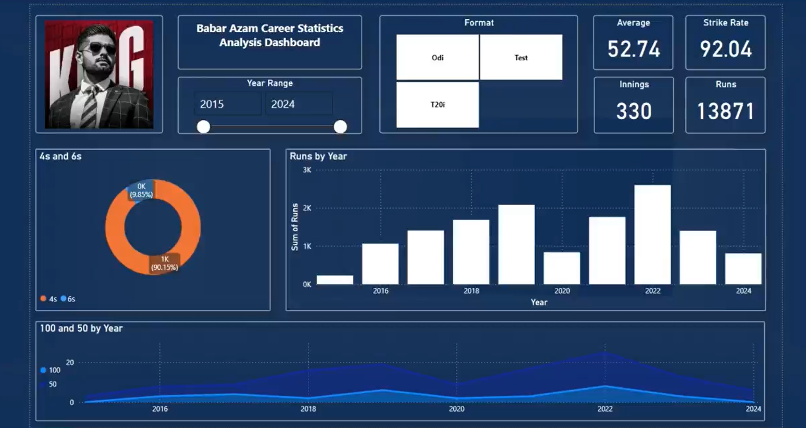

# Cricket-Player-Analysis

### **Overview**
Comprehensive Power BI dashboard analyzing Babar Azam's cricket performance across formats from 2015-2024.

---
 **Project Highlights**
  - Detailed performance analysis
  - Visualization of cricket metrics
  - Multi-format performance tracking

 **Key Performance Metrics**
   - Total Runs
   - Batting Average
   - Strike Rate
   - Innings Played
   - Format-wise Comparisons

 **Data Sources**
   - Excel spreadsheets
   - Cricket performance records

 **Dashboard Capabilities**
   - Interactive performance tracking
   - Yearly trend analysis
   - Comparative format visualization

 **Insights**
   - Performance trend evaluation
   - Format-specific performance breakdown
   - Statistical performance analysis

### Screenshots
#### Dashboard Overview

### **Contact**
For any inquiries or feedback, feel free to contact:  
📧 Email: usama.dev08@gmail.com
